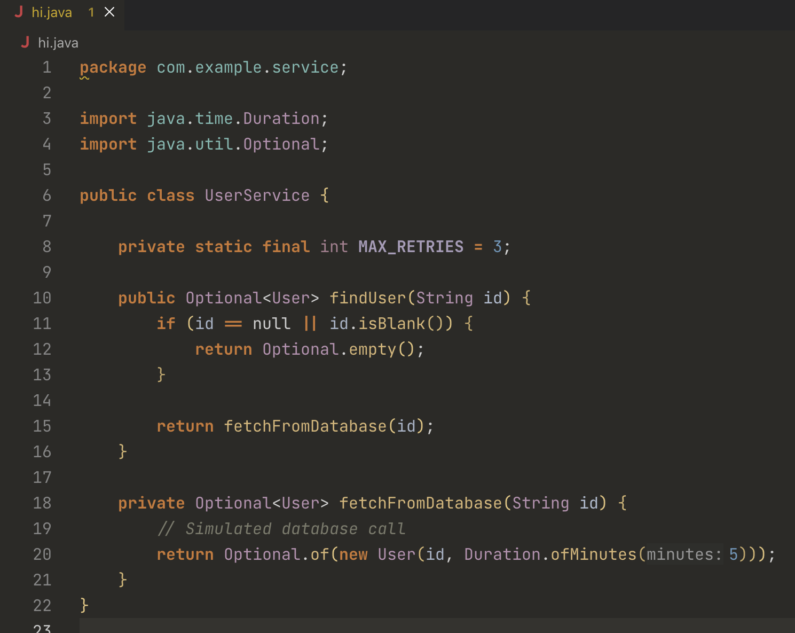
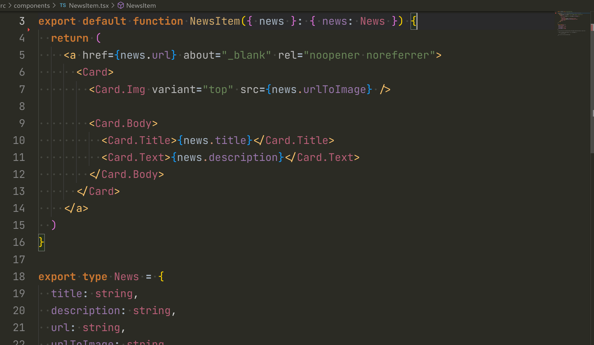

# Darcula Theme by Anurag

A **JetBrains Darcula–inspired dark theme for VS Code**, designed for long backend coding sessions with a strong focus on **Go**, **Java**, and **TypeScript**.

This theme emphasizes:
- Semantic correctness
- Low eye strain
- Clear distinction between types, constants, keywords, and symbols

> Note: This is inspired by JetBrains Darcula, not an official JetBrains theme.

---

## Features

- JetBrains Darcula–inspired dark color palette
- Optimized for Go with semantic token support
- Clear distinction between types, constants, keywords, and packages
- Comfortable contrast for long backend coding sessions
- Works well with JetBrains Mono and antialiased font rendering

---

## What this theme is (and isn’t)

JetBrains’ Darcula is not just a color palette — it is a readability-first design system.
This theme preserves that philosophy while embracing VS Code’s semantic tokens
and modern language servers.

This is NOT a pixel-perfect replica of 2020 IntelliJ Darcula.
Instead, it is a modern Darcula interpretation built specifically for VS Code.

Design goals:
- Long-session comfort
- Semantic clarity
- Minimal visual noise
- Strong backend language support

---

## Primary language support

Actively optimized and maintained for:

- Go (first-class support)
- Java
- C / C++
- JavaScript
- TypeScript
- Python (baseline support)

Other languages inherit safe defaults without compromising Go.

---

## Golang (important)

For the intended Go experience, enable semantic highlighting:

{
  "editor.semanticHighlighting.enabled": true,
  "gopls": {
    "ui.semanticTokens": true
  }
}

This theme relies heavily on semantic tokens to differentiate:

- Structs vs interfaces
- Exported vs unexported symbols
- Packages vs fields vs methods
- Constants and language keywords such as nil, true, and false

---

## Font and rendering (strongly recommended)

This theme is designed and tested with:

- JetBrains Mono
- Antialiased font rendering

Recommended settings:

{
  "editor.fontFamily": "JetBrains Mono",
  "editor.fontLigatures": true,
  "workbench.fontAliasing": "antialiased"
}

Correct font rendering significantly improves:
- Color balance
- Contrast perception
- Overall eye comfort

---

## Previews

### Go

### Java

### JavaScript

### TypeScript

---

## Design principles

- Dark, muted background with low eye fatigue
- No neon or overly saturated colors
- Clear differentiation between:
  - Constants
  - Types
  - Interfaces
  - Structs
  - Packages
  - Keywords like nil, null, and booleans
- Semantic correctness over decorative styling

---

## Contributing

If you encounter issues or want improvements, feel free to open an issue:

https://github.com/AnuragThePathak/darcula-theme/issues

Priority languages:
1. Go
2. Java
3. C / C++
4. JavaScript / TypeScript

Please open an issue before submitting a pull request.
Theme changes are conservative by design.

---

Created by Anurag Pathak  
Inspired by JetBrains Darcula  
Built for Visual Studio Code
