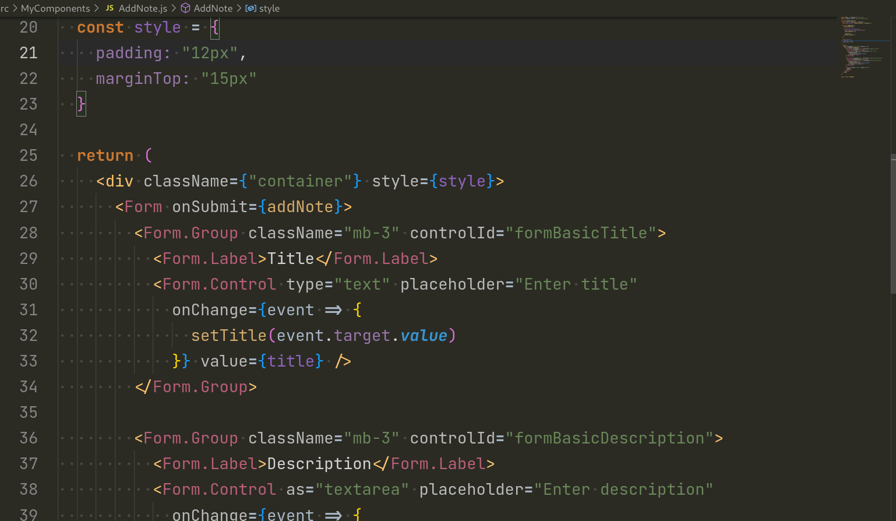
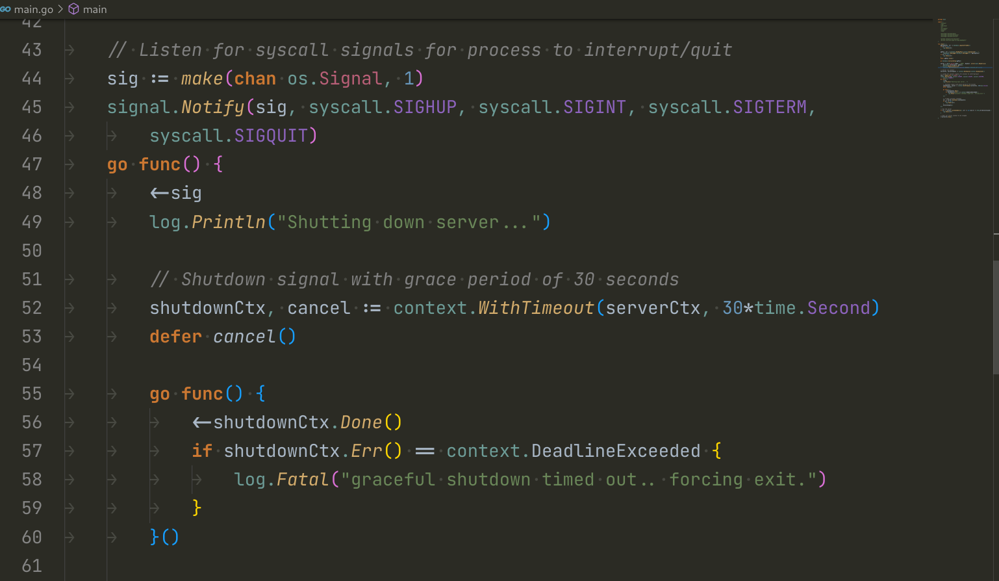

# Dracula Theme by Anurag

Darcula Theme similar to the one in Jetbrains IDEs but modified a little for my personal need. Works well in C/C++, Java, Golang, Javascript, and Typescript. For the best look in Golang, enable Gopls UI semantic tokens. It must be noted it's not possible to have an exact Jetbrains Darcula theme because their theme varies slightly from IDE to IDE. In this case, we are using a single theme to support all the languages.

## Preview

- Javascript
  
- Golang
  

## Contributing

Feel free to [create issues](https://github.com/AnuragThePathak/dracula-theme/issues) if you face any issues or need a new feature. Please note that the above-mentioned languages will always have higher priority.
If you'd like to contribute to this theme, you can fix any of the available issues. It's highly recommended not to make PR directly as what you're thinking might not be useful for others.
