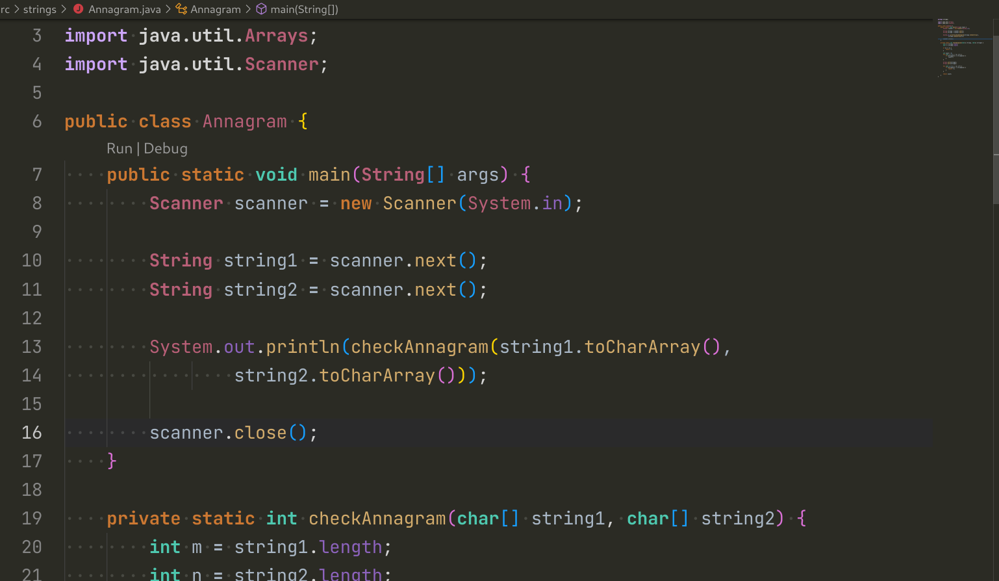

# Darcula (JetBrains) Theme — by Anurag Pathak

A **Darcula dark theme inspired by JetBrains IDEs** such as **IntelliJ IDEA, GoLand, WebStorm, and Rider**, adapted for **VS Code**.

This theme is slightly modified to suit my personal workflow while staying close to the original JetBrains Darcula look and feel.

> ⚠️ Note: This is **Darcula (JetBrains)** — not the Dracula theme.

---

## Why this theme?

JetBrains’ Darcula theme differs slightly across IDEs (IntelliJ, GoLand, WebStorm, etc.), so an exact 1:1 replica isn’t possible.  
This theme uses a **single, consistent color system** that works well across multiple languages in VS Code.

It is optimized primarily for:
- **Golang**
- **Java**
- **C / C++**
- **JavaScript**
- **TypeScript**

---

## Language-specific notes

### Golang
For the best experience in Go:
- Enable **gopls semantic tokens**
- Enable **UI semantic highlighting** in VS Code

This significantly improves readability and token accuracy.

---

## Previews

### Golang

### JavaScript

### TypeScript

### Java

---

## Contributing

If you encounter issues or want improvements, feel free to  
👉 [Create an issue](https://github.com/AnuragThePathak/darcula-theme/issues)

Priority will always be given to:
- Go
- Java
- C / C++
- JavaScript / TypeScript

If you’d like to contribute code, please **open an issue first** instead of submitting a direct PR — changes that work for one setup may not be useful for others.

---

—  
Created by **Anurag Pathak**
